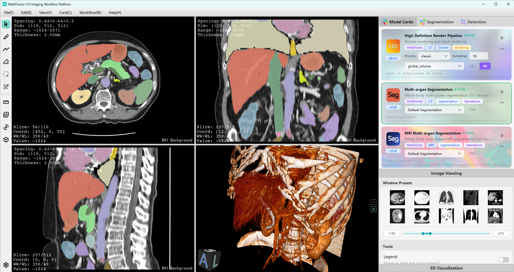
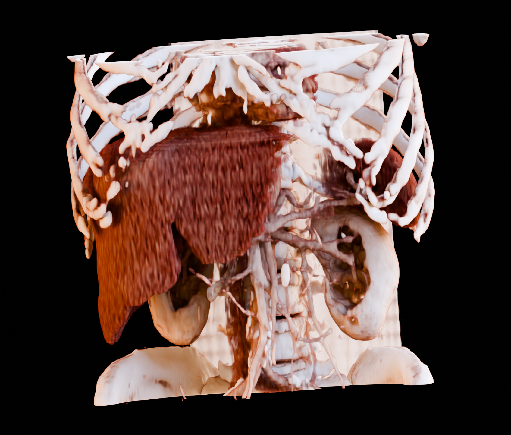

# MedVisora Plugin SDK

[English](README.md) | [简体中文](README.zh-CN.md)

项目主页：[https://medvisora.com/](https://medvisora.com/)

MedVisora 是面向医学影像的模型集成与工作流平台，将模型推理、影像交互与工作流编排整合为一体。通过统一插件规范，将本地模型封装为 Docker 镜像并注册为模型卡，即可复用平台已有的阅片、标注、三维重建与定量分析能力，并在画布中与平台节点自由连接，组成分割、检测与分析等多阶段流程，无需另行开发前端。

模型接入分为两步：首先构建推理镜像，然后通过 `plugin/manifest.json` 注册镜像，即可完成系统集成。容器需遵循[输入输出协议](docs/contract.zh-CN.md)。

**分割模型卡插件**

**渲染模型卡插件**

 

`templates/` 提供最小项目骨架，实现其中的推理入口即可构建镜像；`examples/` 提供完整案例与部署步骤，详见[示例文档](examples/README.zh-CN.md)。配置字段与工作流规范分别见 [manifest 文档](docs/manifest.zh-CN.md)和[节点文档](docs/nodes.zh-CN.md)。

本仓库依据根目录的 [LICENSE](LICENSE) 分发。
